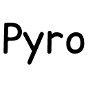
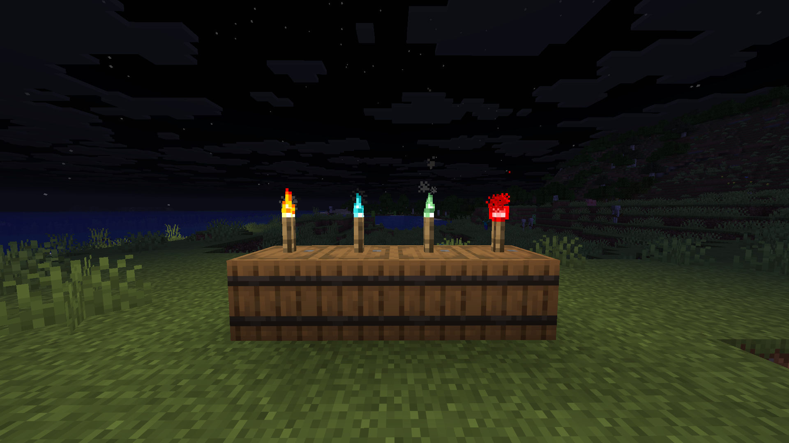
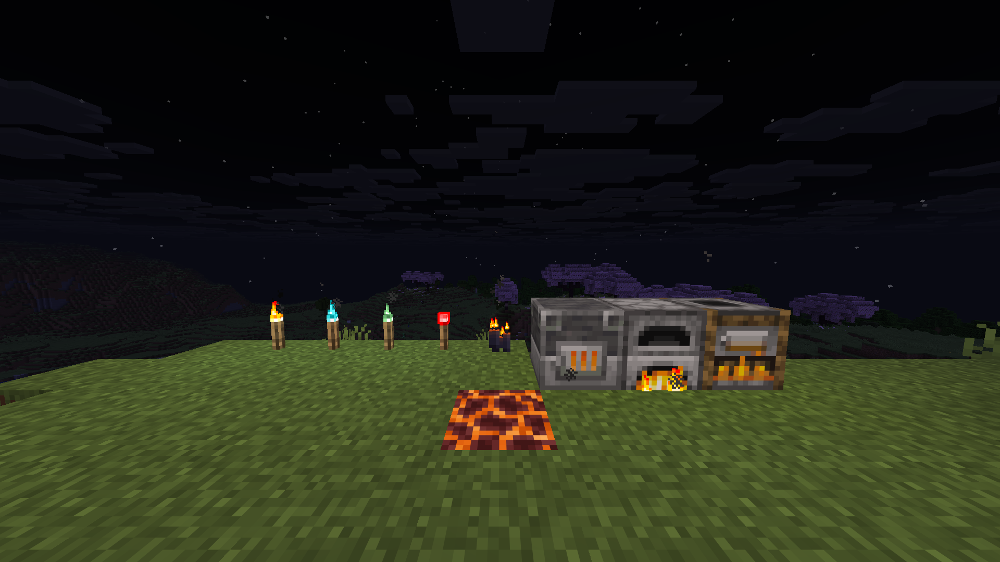
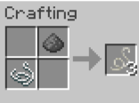
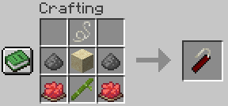
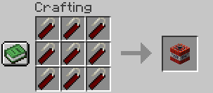

# Pyro

*Light the fuse. Watch it burn.*

---

## Overview

Pyro is a Fabric mod for Minecraft 26.1 that brings hands-on pyrotechnic destruction to survival and adventure play. Throw a stick of dynamite, watch the fuse burn down, and take cover. Every explosion is physics-driven: thrown dynamite lands, sits, and detonates — or goes off in your hand if you wait too long.

---

## Features

### Throwable Dynamite

- Ignite dynamite with a torch or at a campfire, then throw it with right-click
- **4-second fuse** (80 ticks) counts down whether the dynamite is in your hand or mid-air
- Lands on the ground and detonates after the fuse expires — perfect for timed demolitions
- Hold it too long and it **detonates in your inventory** — instant kill for the holder, splash damage to nearby players and mobs
- Blast radius of **2.5 blocks** for block destruction; damage reaches out to **5 blocks**, scaling with distance

---

### Stack-Scaled Inventory Explosion

- Igniting dynamite without throwing it detonates the **entire stack** at once
- Explosion radius, maximum damage, and number of sub-explosions all **scale with stack size**
- Each sub-explosion is offset from the others, spreading blast force across a wider area
- A full stack is far more lethal than a single stick — handle with care

---

### Timed Fuse System

- Unlit dynamite sits safely in your inventory — it will never explode until ignited
- Once ignited, a **custom lit model** replaces the standard dynamite texture so you always know it's live
- The fuse timer persists through throws: if 2 seconds burn down in your hand before you throw, only 2 seconds remain in the air

---

### Dynamic Lights (Optional — LambDynamicLights)

- With [LambDynamicLights](https://modrinth.com/mod/lambdynamiclights) installed, ignited dynamite emits **full-brightness dynamic light (level 15)**
- Light is cast both while held in your hand **and** while the projectile is in flight or resting on the ground
- Purely visual enhancement — the mod runs without it, but dark corridors become dramatically more tense with it

---

## Igniting Dynamite

### With a Torch (Off-hand or Main-hand)

Hold dynamite in one hand and **right-click** while holding any of the following in the other hand:

| Torch | Notes |
|---|---|
| Torch | Standard wood torch |
| Redstone Torch | Works even when powered |
| Soul Torch | Full support |
| Copper Torch | Full support |

---

### At a Lit Campfire

Hold dynamite and **right-click a lit campfire** to ignite it. The campfire must be actively burning — a campfire that has been extinguished will not work.

---

### On Fire

Hold dynamite and **right-click directly on a fire block** to ignite it. Click the fire's hitbox itself — clicking the block underneath will not work. Works with both regular fire and soul fire.

---

### On Lava

Hold dynamite and **right-click directly on lava** to ignite it. Both source blocks and flowing lava work.

---

### Other Ignition Sources

Dynamite can be ignited by right-clicking almost any open flame or active heat source in the world — torches, burning furnaces, lit candles, and more. If it's on fire, it can light a fuse.

---

## Crafting Recipes

### Fuse

> Crafted shapeless — combine **1× Gunpowder** + **1× String** → **3× Fuse**

---

### Dynamite

> Shaped recipe (3×3 crafting grid):

Yields **2× Dynamite**.

---

### TNT

> Shaped recipe (3×3 crafting grid) — **replaces the vanilla TNT recipe**:

Fill the entire grid with **9× Dynamite** to craft **1× TNT**. The vanilla gunpowder-and-sand recipe no longer works — TNT is now gated behind Pyro's crafting chain.

---

## Optional Compatibility

### LambDynamicLights

Pyro has built-in optional support for [LambDynamicLights](https://modrinth.com/mod/lambdynamiclights). No extra configuration is needed — install both mods and dynamic lighting activates automatically.

**What it adds:**
- Lit dynamite in your hand illuminates the area around you at full light level
- Thrown or landed dynamite continues to cast light until it detonates
- Makes underground demolition runs dramatically more atmospheric

---

## Installation

1. Install [Fabric Loader 0.18.6+](https://fabricmc.net/use/) for Minecraft 26.1
2. Download [Fabric API 0.145.1+26.1](https://modrinth.com/mod/fabric-api)
3. Place both `.jar` files in your `mods/` folder
4. *(Optional)* Add [LambDynamicLights](https://modrinth.com/mod/lambdynamiclights) for dynamic lighting support
5. Launch Minecraft 26.1 and enjoy

---

## Requirements

| Dependency        | Version      | Required |
|-------------------|--------------|----------|
| Minecraft         | 26.1         | Yes      |
| Fabric Loader     | ≥ 0.18.6     | Yes      |
| Fabric API        | 0.145.1+26.1 | Yes      |
| Java              | ≥ 25         | Yes      |
| LambDynamicLights | ≥ 4.10.0     | Optional |
